# Bootcamp

[View live project here](https://github.com/JeyAsare/bootcamp.git)

#### For my Milestone 2 Project I have created an interactive quiz game using HTMl, CSS and Javascript

## User Experience

### Aims

This current project Bootcamp in Web Application Development, tested my knowledge and ability to use javascript to create an interactive browser page for users. BOOTCAMP is a trivial quiz game that can be played by anyone who has an interest in general knowledge and the game was styled to fit a gameplay of a millitary camp.

### User Goals

- Play a fun and engaging quiz game.
- Be tested on general knowledge and also aquire new knowledge.
- Unlock different difficulty levels.

### Site Owner Goals

- To create a fun and engaging quiz game for users of any age.
- Provide a game that is responsive on any device.
- Style the game to make it look fitting and pleasing to the user.

### User Stories

- I want to be able to play BOOTCAMP from start to finish.
- I want to be able to see my score at the end of every question.
- I want to be able to unlock harder difficulties once I have completed the previous diffulty.

## Project Scope

To create a simple yet effective game, I decided that only one main HTML page was needed for the user. This HTML page consisted of a game-title containing the title of the game and a picture logo.

I then split my HTML into four different sections that the user will see as they progressed into the game:

1. This is the start of the game where the user receives an introuctory message from the colonel of the game and also a start button which takes the user onto the next page.

2. This section is the difficulty section where the user clicks on the specified difficulty to start the quiz.

3. This section is the quiz where the user will be tested on their general knowledge. There are 10 questions in total.

4. This section shows the user their score. If the user gets above a certain threshold then they pass and move onto the next level however if the user fails they will be redirected to restart the questions again at the same difficulty.

## Wireframes

### I used Balsamiq Wireframes to create the basic structure of my game

Desktop Version:

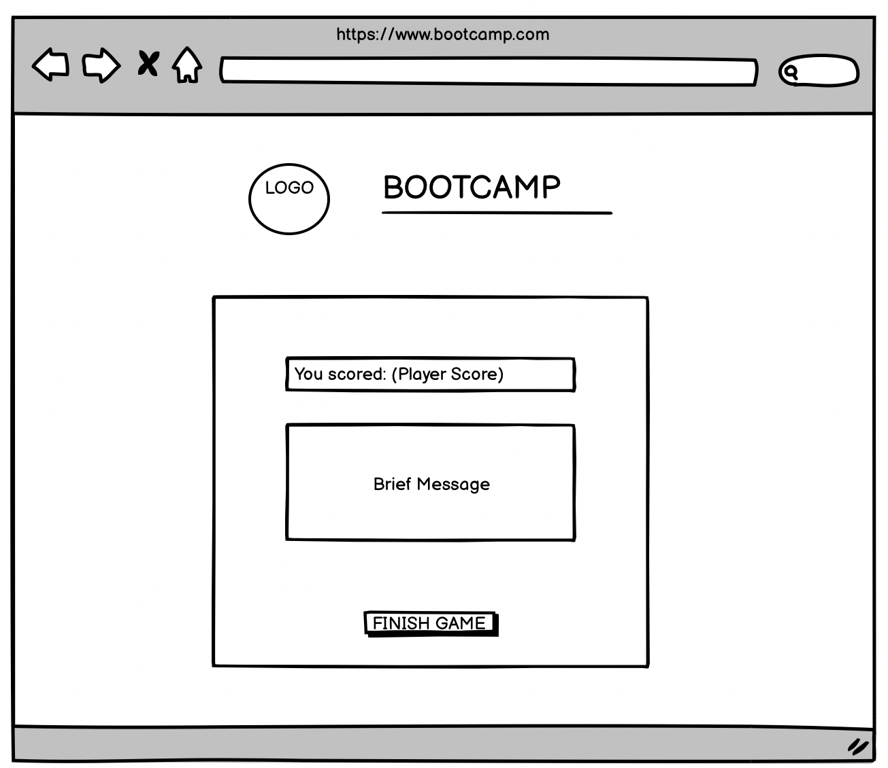

IPAD Version:

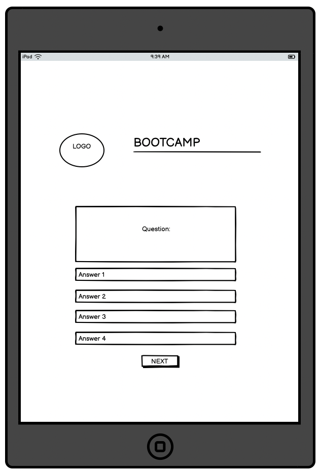

Mobile Versrion:

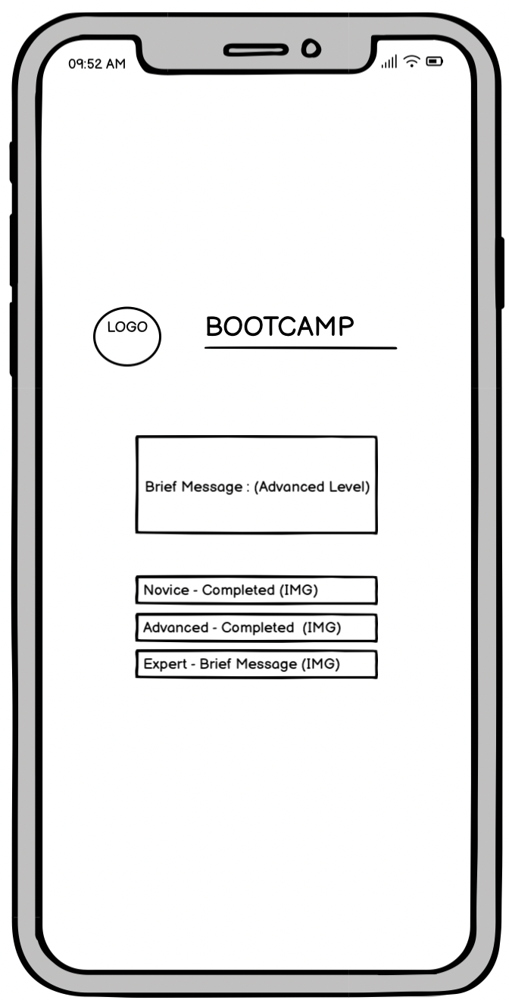

## Design

### Typography

I primarily and only used Bebas Neue as my font-family in the game that meant that all text being written is from this font. I also used Sans Serif incase my primary font did not load on the page for any given reason.

### Colors/Colours

- rgb(20, 209, 20) - Bright Green
- rgb(6, 72, 26) - Dark Green
- rgb(34, 15, 1) - Dark Mud Brown
- rgb(65, 59, 59) - Dark Grey
- rgb(230, 170, 6) - Bright Yellow
- black
- blanchedalmond
- gold
- red

Whilst planning this game I wanted my colour theme to essentially revolve around the colours brown, green, grey and black to set the scene of an actual military bootcamp. I used the bright green as I believed it to be a very good contrast compared to the nature of the other dark colours.
The other colours used were to add extra appeal to the user as I wanted to still give the user the gaming experience.

## Game Features

Page 1

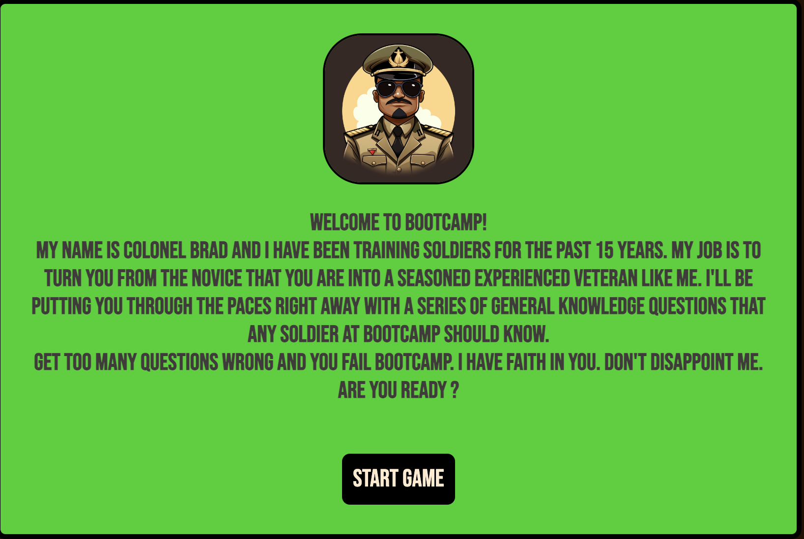

Page 2

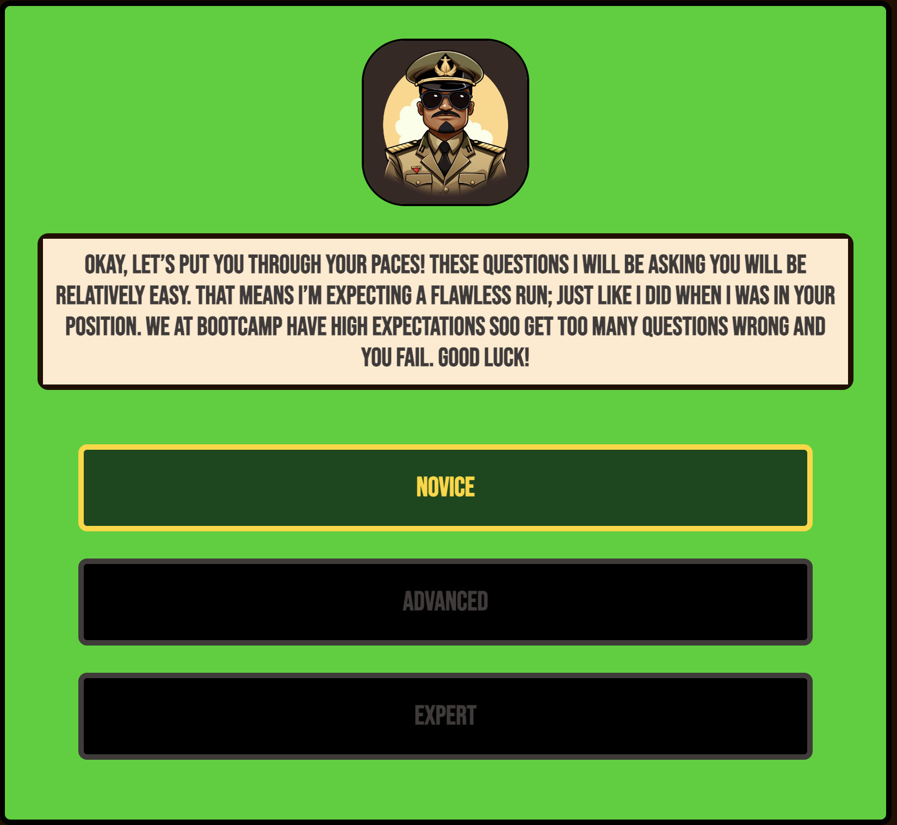

Page 3

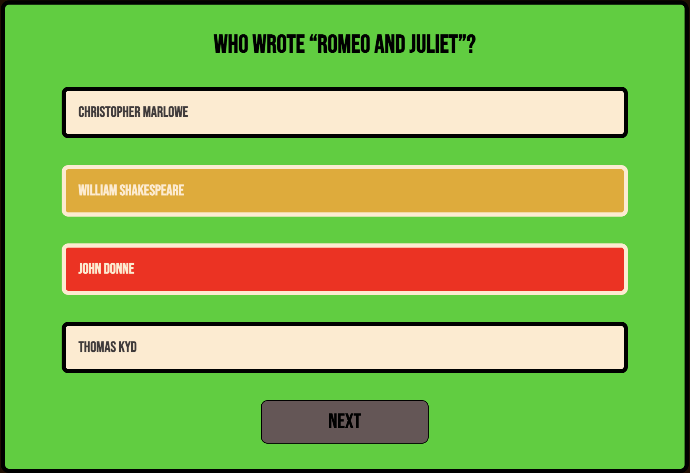

Page 4

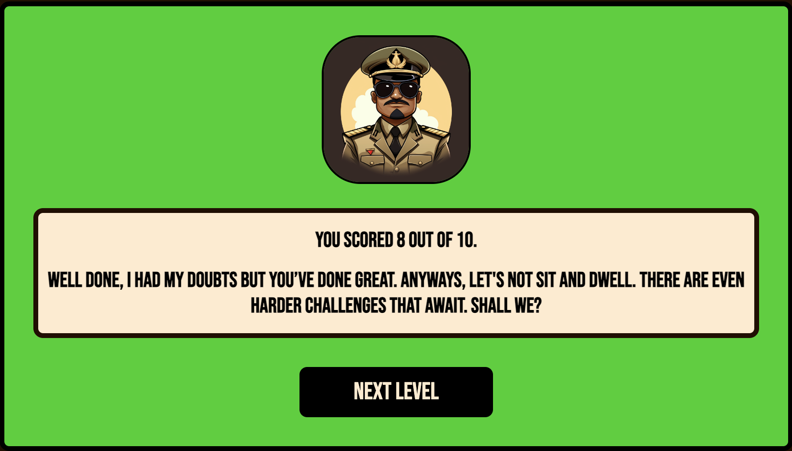

## Future Implementations

#### The game is originally a demo created for my milestone project but in the near future I would like to implement more aspects to make BOOTCAMP a full game for users I would do this by

- Increasing the number of difficulties in the game as currently I only have 3.
- Whilst developing the project I thought to implement a quit game option which would take users to that start of the game instead of them having to constantly refresh the game.
- Also, whilst developing the project I found out that generating questions was a time consuming aspect and that my game could be limited to how many sets of questions I have. Maybe for future development I can find a way to import already generated questions and answers into my game to keep the longevity of my game for users.
- My game has a character Colonel Brad who is present for the entirety of the game and maybe I in the future I could add a voice to bring him more to life for the user.
- Apart from unlocking a next level, the user doesn't receieve other rewards or satisfaction from BOOTCAMP. Next time I could add a section where the user could attain achievements from Colonel Brad for their progress.

## Technologies Used

### Languages

- HTML
- CSS
- Javascript

### Framework, Libraries and Programs Used

- Balsamiq Wireframes.
- Github.
- Codeanywhere.
- Font Awesome.
- Google Fonts.
- JS Hint.
- W3C Markup Validation.

## Deployment

Github Pages was used to deploy the live website:

1. Log in to Github.
2. Find the repository for this project.
3. Click on the settings link.
4. Click on the Pages link in the left hand side of the navigation bar.
5. In the source section, choose main from the drop down select branch menu.
6. Select Root from the drop donn selct folder menu.
7. Click Save.
8. Your live Github Pages site has now been deployed.
   
# Testing

## Manual Testing

### Language Validation

- I used W3C validator to validate both my HTML and CSS codes:

HTML

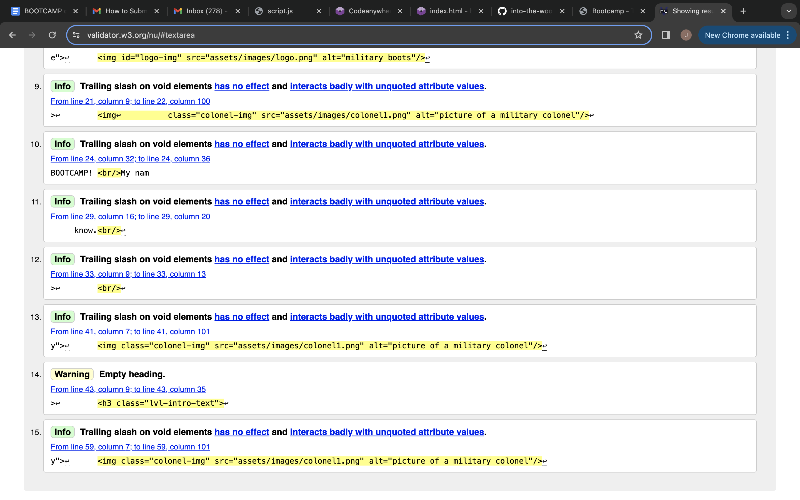
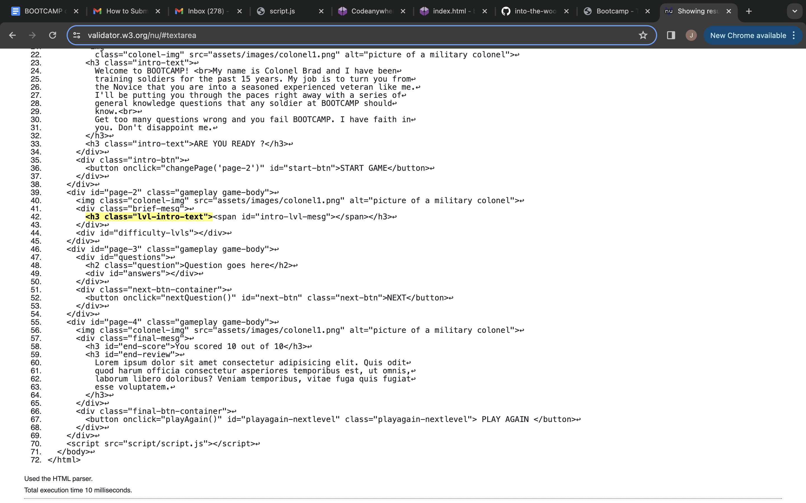

Both images represent before and after I had validated and improved my code.

CSS

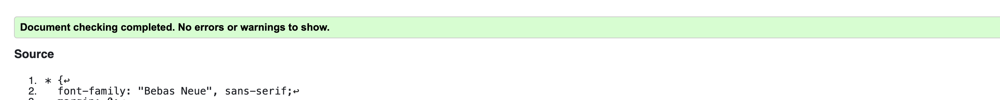

- I sed JSHint to validate my Javascript code

Javascript

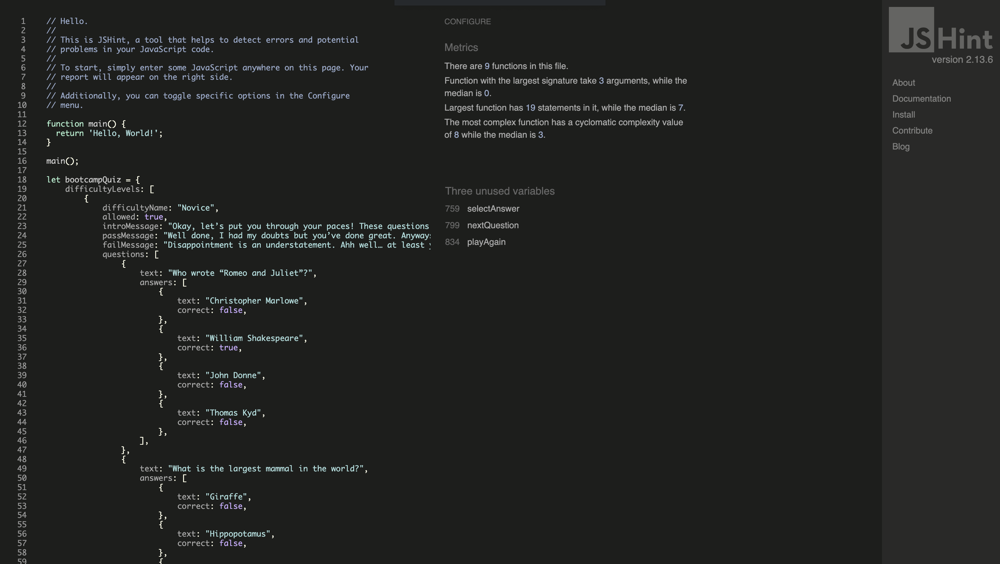

### Performance Testing

- I ran my site through Lighthouse which is a chrome developer tool to check the performance of mt site.

Lighthouse Testing

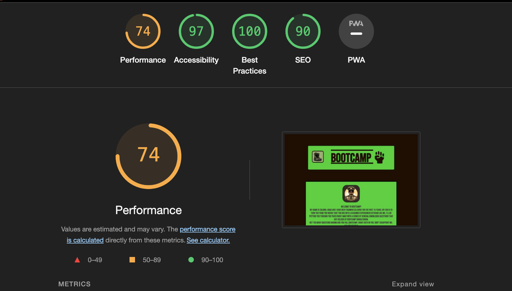

### Testing User Stories

- I want to be able to play BOOTCAMP from start to finish.
Bootcamp is a very simplistic game to play as it only requires users to click buttons on a desktop or to tap on tablets or mobile devices to advance in the game. The game is very straightforward and the user will never at any point be confused at what stage they are at.

- I want to be able to see my score at the end of every question.
At the end of every set of questions, the user will see how many questions they got right. It will be met with either a congratualtions message telling them they have passed or a failure message if they have failed.

- I want to be able to unlock harder difficulties once I have completed the previous diffulty.
Difficulties that are locked will be identified through a specific colour way and once they have been completed will be highlighted in another colourway.

### Testing Site Features

Manual Testing Features

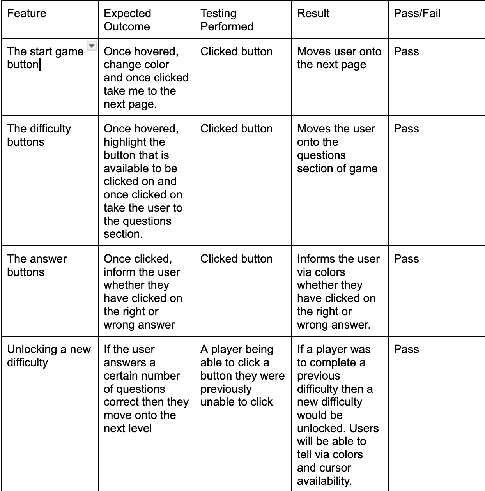

### Other Testing

Browser testing was done on the folowing devices:

- Apple Mac
- MacBook Pro
- Iphone 14 pro max

Browser testing was done on the following browsers:

- Google Chrome
- Safari
- Microsoft Edge

## Bugs

- There are currently no bugs in this project.

## Credits

### Code Used

- GreatStack: Youtube Similiar project to mine so helped me navigate through the game functionality.
- All other code was created by developer Jeremy Amoako

### Content

- ChatGPT: Used to generate questions.
- Midjourney: Used to create game images.

### Acknowledgements

- Iris Smok - Cohort Facilitator, always somebody who is willing to help
- Family and Friends - Constant support and push to get my work done
